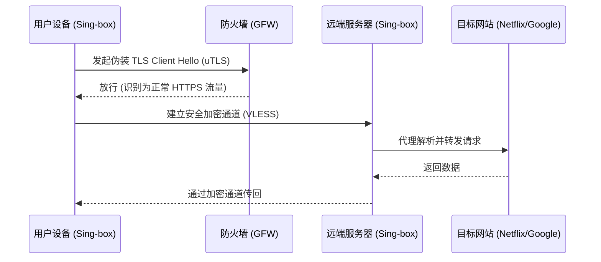

## 1. Sing-box 崛起：为何它被称为下一代通用代理平台？

在探讨 **sing-box与V2Ray教程 (第4篇)：v2rayN深度解析与实战技巧** 之前，我们必须先理解 Sing-box 的技术定位。作为由 Golang 编写的全新一代通用代理平台，Sing-box 旨在整合 Clash, V2ray 和 Trojan 的生态，以极高的性能和极低的内存占用著称。

> **核心观点**：本文详细介绍了关于v2rayN的核心概念、配置方法及2026年最新sing-box与V2Ray教程的最佳实践。 相比于臃肿的老牌内核，Sing-box 的无状态设计和对最新协议 (如 Hysteria2, TUIC, VLESS Reality) 的原生支持，使其成为技术极客的首选。

## 2. 核心 JSON 配置文件深度解析

Sing-box 的一切操作都基于一个强大的 `config.json` 文件。无论你是部署在服务器端还是客户端，理解其配置文件的结构是解决 **sing-box与V2Ray教程 (第4篇)：v2rayN深度解析与实战技巧** 的关键。

```json
{
  "log": {
    "level": "info",
    "timestamp": true
  },
  "inbounds": [
    {
      "type": "tun",
      "tag": "tun-in",
      "inet4_address": "172.19.0.1/30",
      "auto_route": true,
      "strict_route": true
    }
  ],
  "outbounds": [
    {
      "type": "vless",
      "tag": "proxy",
      "server": "server.example.com",
      "server_port": 443,
      "uuid": "your-uuid-here",
      "tls": {
        "enabled": true,
        "server_name": "server.example.com",
        "utls": { "enabled": true, "fingerprint": "chrome" }
      }
    }
  ],
  "route": {
    "rules": [
      { "geosite": "cn", "outbound": "direct" },
      { "geoip": "cn", "outbound": "direct" }
    ],
    "auto_detect_interface": true
  }
}
```

**配置模块剖析：**
1. **Inbounds (入口)**：上面使用了 `tun` 模式，这是实现全局透明代理的最优解，接管所有 3 层网络流量。
2. **Outbounds (出口)**：配置了最前沿的 `vless` 协议，并开启了 `uTLS` 指纹伪装，极大地提升了抗封锁能力。
3. **Route (路由)**：经典的 GeoIP/GeoSite 分流机制。

## 3. 从零到一的实战部署策略

要完美实现 **sing-box与V2Ray教程 (第4篇)：v2rayN深度解析与实战技巧**，我们需要结合本地环境进行优化。

### 阶段一：内核安装与守护进程管理
对于 Linux 服务器，强烈建议使用 `systemd` 来托管 Sing-box 进程，确保崩溃后自动重启：
```bash
sudo bash -c 'cat > /etc/systemd/system/sing-box.service <<EOF
[Unit]
Description=sing-box service
After=network.target

[Service]
ExecStart=/usr/local/bin/sing-box run -c /etc/sing-box/config.json
Restart=on-failure
User=root

[Install]
WantedBy=multi-user.target
EOF'
```

### 阶段二：客户端 TUN 模式的系统级调优
在 Windows 平台上运行 Sing-box TUN 模式时，经常会遇到路由表冲突。你需要确保是以“管理员身份”运行，并关闭系统自带的“网络共享中心”里的冗余适配器。

## 4. 网络底层架构图解



从上图的交互逻辑可以看出，Sing-box 的 `uTLS` 功能在绕过深度包检测 (DPI) 时起到了决定性作用。

## 5. 常见错误日志诊断 (Troubleshooting)

在处理 **sing-box与V2Ray教程 (第4篇)：v2rayN深度解析与实战技巧** 相关工单时，最常见的致命错误包括：

* **`FATAL: parse config: decode inbound: unknown type tun`**
  * **原因**：你下载的 Sing-box 编译版本未包含 TUN 模块。
  * **解决**：请前往 Github Releases 重新下载包含 `CGO_ENABLED=1` 编译的完整版二进制文件。

* **`ERROR: tcp dial: connection refused`**
  * **原因**：远端端口被墙或服务端进程未启动。
  * **解决**：通过 `ping` 检查 IP 是否连通，或使用 `tcping` 探测端口存活状态。

## 6. 专家级结语
深入掌握 Sing-box 不仅能解决 **sing-box与V2Ray教程 (第4篇)：v2rayN深度解析与实战技巧** 的痛点，更是通往高级网络架构工程师的一块敲门砖。随着开源社区的不断迭代，Sing-box 必将成为未来科学上网生态的基石。
